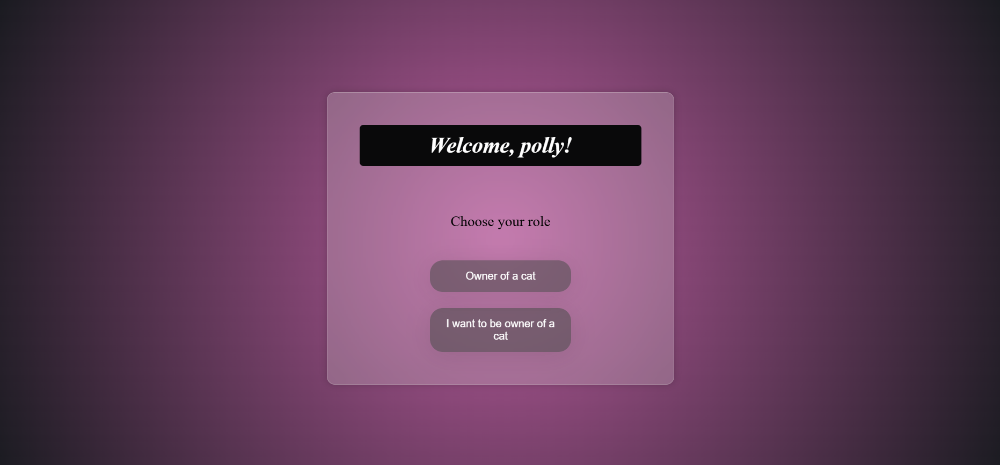
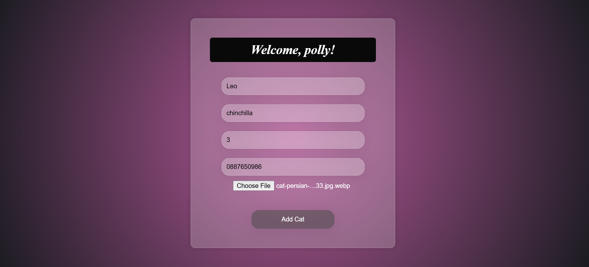
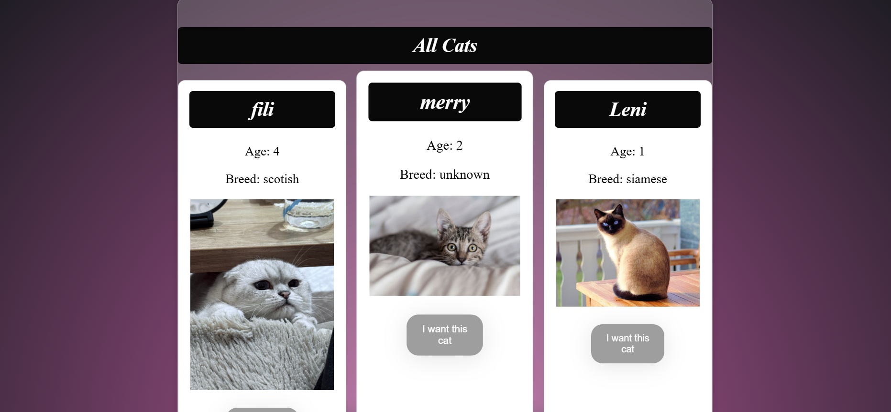

# Cat App

A simple web application for posting and browsing cat listings.

## Features

* User registration
* Add a new cat
* View cat catalog
* Contact the cat owner

## Screenshots

### Login

### Role

### Add Cat

### Catalog

## Technologies

* Python (Flask)
* MySQL
* HTML & CSS

## Database Setup

Create a database named `cat_app` and configure your MySQL credentials.

## Run the app

python app.py

## Live Demo
The application is deployed and can be accessed here:
https://cat-app-rhie.onrender.com
